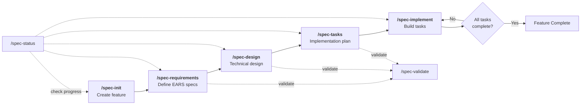

# Spec-Driven Workflow Plugin for Claude Code

A structured development workflow plugin that guides you through **requirements -> design -> tasks -> implementation** using EARS notation.

## Overview

This plugin implements a spec-driven development approach inspired by Kiro's methodology. It enforces structured requirements using EARS (Easy Approach to Requirements Syntax) notation, generates technical design documents, breaks down work into trackable tasks, and guides implementation step-by-step.

All specifications are stored in a `.specs/` directory, keeping your feature documentation organized and version-controlled alongside your code.

## Installation

Copy the plugin to your Claude Code plugins directory:

**Per-project** (recommended):
```
your-project/
└── .claude/
    └── plugins/
        └── spec-driven-workflow/
            ├── .claude-plugin/
            │   └── plugin.json
            ├── agents/
            ├── commands/
            ├── scripts/
            └── README.md
```

**Or use as a standalone plugin:**
```bash
claude --plugin-dir /path/to/spec-driven-workflow
```

## Workflow



## Commands

| Command | Description | Example |
|---------|-------------|---------|
| `/spec-init` | Initialize a new feature specification | `/spec-init User Authentication` |
| `/spec-requirements` | Generate structured requirements with EARS notation | `/spec-requirements user-authentication` |
| `/spec-design` | Create technical design document with architecture diagrams | `/spec-design user-authentication` |
| `/spec-tasks` | Generate sequenced implementation tasks | `/spec-tasks user-authentication` |
| `/spec-implement` | Implement a specific task or the next pending task | `/spec-implement user-authentication 1.1` |
| `/spec-status` | Show status of all specs or a specific feature | `/spec-status user-authentication` |
| `/spec-validate` | Validate EARS syntax and spec completeness | `/spec-validate user-authentication` |

## EARS Notation

All acceptance criteria must follow strict EARS patterns:

| Pattern | Syntax | Use Case |
|---------|--------|----------|
| Ubiquitous | `THE [System] SHALL [behavior]` | Always-true requirements |
| Event-Driven | `WHEN [event] THE [System] SHALL [response]` | Triggered behaviors |
| State-Driven | `WHILE [state] THE [System] SHALL [behavior]` | Ongoing conditions |
| Optional | `WHERE [feature] THE [System] SHALL [behavior]` | Feature-dependent behavior |
| Error Handling | `IF [condition] THEN THE [System] SHALL [response]` | Edge cases & errors |
| Complex | `WHILE [state] WHEN [event] THE [System] SHALL [response]` | Multi-condition scenarios |

**Rules:**
- Keywords must be UPPERCASE: `WHEN`, `THE`, `SHALL`, `IF`, `THEN`, `WHILE`, `WHERE`
- Always use `SHALL` - never "should", "must", or "will"
- Every criterion must be specific and testable

## Generated Files

For each feature, the workflow creates:

```
.specs/
└── user-authentication/
    ├── requirements.md    # EARS-formatted requirements
    ├── design.md          # Technical design with Mermaid diagrams
    └── tasks.md           # Checkable implementation tasks
```

## Components

### Agents

| Agent | Purpose |
|-------|---------|
| `spec-requirements` | Generates structured requirements with EARS notation |
| `spec-design` | Creates technical designs analyzing existing codebase patterns |
| `spec-tasks` | Breaks down design into sequenced, trackable implementation tasks |

### Scripts

| Script | Purpose |
|--------|---------|
| `ears-validator.js` | Validates EARS syntax in requirements documents |

## Quick Start

1. **Initialize a new feature:**
   ```
   /spec-init Shopping Cart
   ```

2. **Describe what you want to build** when prompted, then generate requirements:
   ```
   /spec-requirements shopping-cart
   ```

3. **Review requirements**, iterate if needed, then create the design:
   ```
   /spec-design shopping-cart
   ```

4. **Generate implementation tasks:**
   ```
   /spec-tasks shopping-cart
   ```

5. **Start implementing:**
   ```
   /spec-implement shopping-cart
   ```

6. **Check progress anytime:**
   ```
   /spec-status shopping-cart
   ```

## EARS Validator Usage

You can run the EARS validator directly:

```bash
node scripts/ears-validator.js .specs/my-feature/requirements.md
```

This will validate all acceptance criteria and report any EARS syntax violations.
